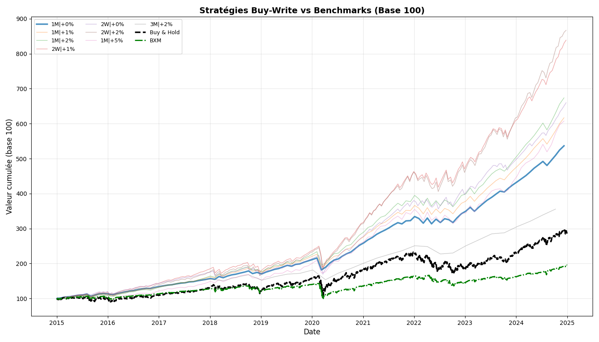
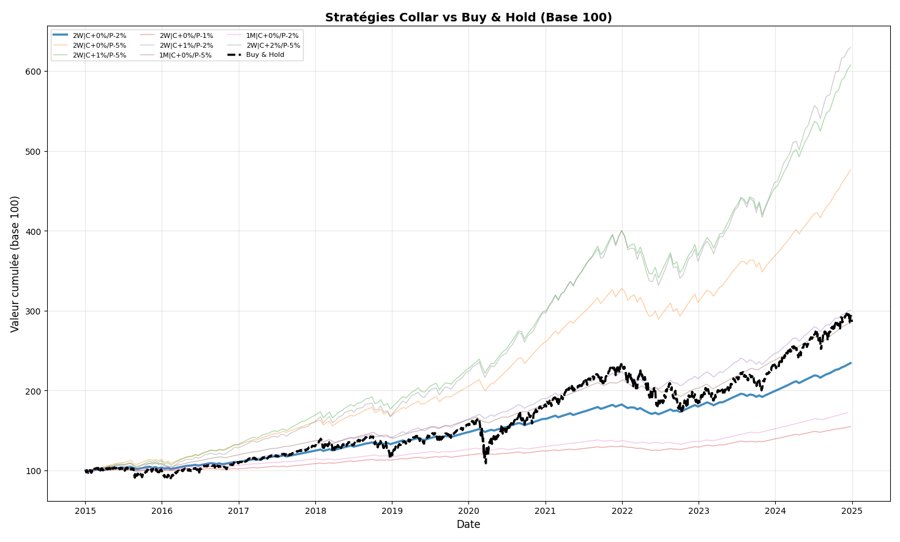
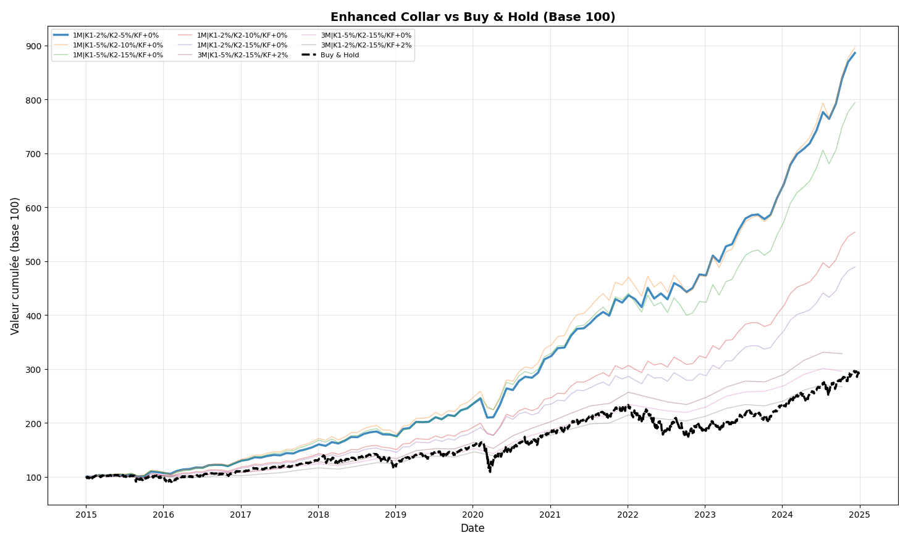

# QIS-Project


# Options-Based Equity Protection Strategies — Backtesting Framework

This repository contains the implementation and backtesting framework for three systematic options strategies applied to the S&P 500 index, developed as part of a quantitative finance thesis. All strategies are evaluated over the period **2015–2025** using daily market data (SPX, VIX, 3-Month T-Bill rate) sourced via `yfinance`. Option pricing relies on the **Black–Scholes model**, with implied volatility proxied by the VIX index.

---

## Repository Structure

```
├── buywrite.py              # Buy-Write (Covered Call) strategy
├── collar.py                # Collar strategy
├── enhanced_collar.py       # Enhanced Collar strategy
├── buy_write_results.csv    # Optimization results — Buy-Write
├── collar_results.csv       # Optimization results — Collar
├── enhanced_collar_results.csv  # Optimization results — Enhanced Collar
```

---

## Strategies

### 1. Buy-Write (Covered Call)

The Buy-Write strategy consists of holding a long position in the S&P 500 while **systematically selling an OTM call option**. The short call generates premium income that cushions downside returns but caps upside participation beyond the strike.

**Payoff at expiry:**

$$\Pi = (S_T - S_0) + (C_0 - \max(S_T - K, 0))$$

The strategy is benchmarked against the **CBOE BXM Index**, which represents the standard 1-month at-the-money buy-write on the S&P 500.

**Optimization grid:**
- Maturities: 2W, 1M, 3M
- Strike offsets: 0%, +1%, +2%, +5% OTM



---

### 2. Collar

The Collar strategy extends the Buy-Write by adding **downside protection through a long OTM put**, while funding it partially through the sale of an OTM call. The result is a bounded return profile — both upside and downside are capped.

**Position:**
- Long S&P 500
- Short OTM call at $K_{call} = S_0 \times (1 + \delta_c)$
- Long OTM put at $K_{put} = S_0 \times (1 - \delta_p)$

**Payoff at expiry:**

$$\Pi = (S_T - S_0) + (C_0 - \max(S_T - K_{call}, 0)) + (\max(K_{put} - S_T, 0) - P_0)$$

The call and put offsets are optimized independently, allowing for asymmetric collar structures.

**Optimization grid:**
- Maturities: 2W, 1M, 3M
- Call offsets: 0%, +1%, +2%, +5% OTM
- Put offsets: 0%, -1%, -2%, -5% OTM



---

### 3. Enhanced Collar

The Enhanced Collar is a more sophisticated structure that replaces the vanilla short call with a **short forward-start call**, and substitutes the single long put with a **long put spread**. This construction reduces the cost of protection while preserving a meaningful hedge against sharp drawdowns.

**Position:**
- Long S&P 500
- Long put spread: long put at $K_1 = S_0(1-\delta_1)$, short put at $K_2 = S_0(1-\delta_2)$, with $\delta_2 > \delta_1$
- Short forward-start call: strike $K_F \times S_{T_0}$, starting at $T_0$, expiring at $T$

#### Forward-Start Call Pricing (Rubinstein)

The forward-start call has payoff $\Pi = (S_T - K_F S_{T_0})^+$. Under Black–Scholes, exploiting the independence of increments and multiplicative homogeneity:

$$V(0) = S_0 \cdot C_{BS}(1,\ K_F,\ T - T_0,\ r,\ \sigma)$$

This means the price factors directly through $S_0$, with the residual maturity $T - T_0$ as the effective time to expiry. In the ATM case ($K_F = 1$):

$$V(0) = S_0 \left[ \mathcal{N}\!\left(\frac{\sigma\sqrt{T-T_0}}{2}\right) - e^{-r(T-T_0)}\,\mathcal{N}\!\left(-\frac{\sigma\sqrt{T-T_0}}{2}\right) \right]$$

#### Put Spread Pricing

Both legs of the put spread are priced independently under Black–Scholes using the VIX as implied volatility proxy:

$$\text{Put Spread Cost} = P(S_0, K_1, T) - P(S_0, K_2, T)$$

**Payoff at expiry:**

$$\Pi = (S_T - S_0) + (\max(K_1 - S_T, 0) - \max(K_2 - S_T, 0) - \text{Spread Cost}) + (C_{FSC} - \max(S_T - K_F S_{T_0}, 0))$$

**Optimization grid:**
- Maturities: 1M, 3M
- $K_1$ offsets: -2%, -5%
- $K_2$ offsets: -5%, -10%, -15%
- $K_F$ values: 1.00, 1.02, 1.05
- Forward-start window $T_0$: 1 month (21 trading days)



---

## Methodology

All strategies share a common backtesting engine:

- **Rolling rebalancement** at fixed intervals (maturity_days)
- **Black–Scholes pricing** at each roll date using spot VIX as $\sigma$
- **Performance measured** as a cumulative index (base 100)
- **Metrics reported:** annualized return, annualized volatility, Sharpe ratio, maximum drawdown

The risk-free rate is sourced from the 3-Month T-Bill (^IRX) and transaction costs of 10bps per period are applied uniformly.

---

## Performance Metrics

| Strategy | Annual Return | Volatility | Sharpe Ratio | Max Drawdown |
|---|---|---|---|---|
| Buy & Hold (SPX) | — | — | — | — |
| Best Buy-Write | — | — | — | — |
| Best Collar | — | — | — | — |
| Best Enhanced Collar | — | — | — | — |

*Fill in after running the full optimization.*

---

## Dependencies

```bash
pip install numpy pandas scipy yfinance matplotlib
```

---

## Usage

```bash
python buywrite.py
python collar.py
python enhanced_collar.py
```

Each script runs the full optimization, prints the top 5 configurations by Sharpe ratio, exports results to CSV, and displays the performance plot.

---

## References

- Black, F., & Scholes, M. (1973). *The Pricing of Options and Corporate Liabilities*. Journal of Political Economy.
- Rubinstein, M. (1991). *Pay Now, Choose Later*. Risk Magazine.
- CBOE (2022). *BXM Index Methodology*.
